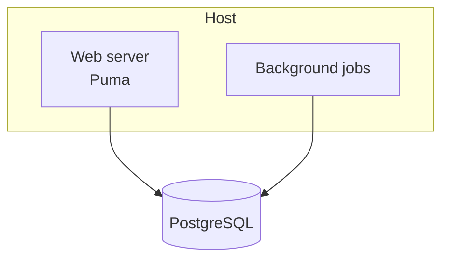
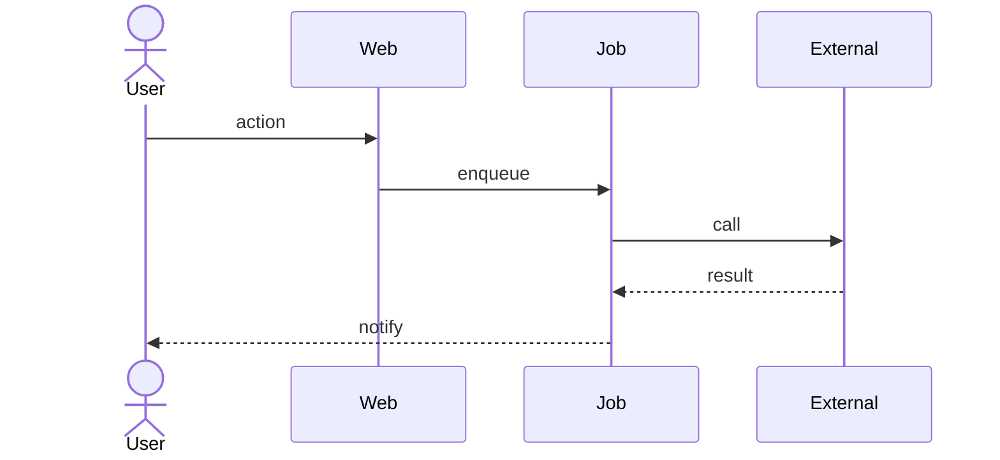

# {{PROJECT_NAME}} — Architecture

<!-- 🔴 A LIVING DOCUMENT. Any service, job, external dependency or structural
     decision added or removed updates this file IN THE SAME COMMIT. An
     architecture document that lags is worse than none: decisions get made on
     it. If you are reading this and it does not match the code, fixing it is
     part of the task you are on. -->

**Last updated:** <!-- YYYY-MM-DD --> · **Reviewed by:** <!-- name + date -->

---

## 1. Context

<!-- Who and what talks to the system, from outside. C4 level 1. Keep it to
     actors and external systems — no internals here. -->

```mermaid
graph LR
    User[User] --> App[{{PROJECT_NAME}}]
    App --> DB[(PostgreSQL)]
    App --> Ext[External service]
```

**External dependencies on the critical path:**

| Dependency | Used for | Fails how | Fallback |
|---|---|---|---|
| | | | |

<!-- Each row is something that can be down while you present. A dependency
     with no fallback is a decision, and it belongs in §3. -->

## 2. Containers

<!-- C4 level 2: the deployable pieces and what runs where. One box per thing
     that can be restarted independently. -->



| Container | Responsibility | Runs on | Scales how |
|---|---|---|---|
| | | | |

## 3. Structural decisions

<!-- The choices someone would otherwise undo without knowing what they cost.
     One line each; the full reasoning goes in docs/decisions/ as an ADR. -->

| # | Decision | Rationale | Consequence accepted | ADR |
|---|---|---|---|---|
| A-1 | | | | |

## 4. Critical flows

<!-- One sequence diagram per flow where the ordering actually matters —
     payment, authentication, anything asynchronous. Not the CRUD. -->



**What happens when a step fails:** <!-- per flow. The answer "it retries" is
only an answer with a limit and a dead-letter destination. -->

## 5. Data

Structure of record: [`SCHEMA.md`](SCHEMA.md) — kept in sync with `db/schema.rb`.

| Concern | Choice |
|---|---|
| Source of truth | |
| Migrations | <!-- reversible? tested how? --> |
| Retention / deletion | <!-- ties back to PRD §8 personal data --> |
| Backups | <!-- taken by whom, restored how, tested when --> |

<!-- A backup nobody has restored is a hypothesis. Note the last restore test. -->

## 6. Security

| Concern | Choice |
|---|---|
| Authentication | |
| Authorisation | |
| Secrets | <!-- where they live in each environment; never in Git --> |
| Personal data | <!-- what is stored, where, who can read it --> |
| Known exposure | <!-- what is deliberately not protected, and why --> |

## 7. Environments and deployment

| Environment | URL | Deployed by | Database | Notes |
|---|---|---|---|---|
| Development | localhost | — | | |
| Production | | | | |

**Deployment:** <!-- trigger, migrations, rollback. A rollback nobody has run
     is a hypothesis too — say where it is documented. -->

## 8. Observability

| Question | Answered by |
|---|---|
| Is it up? | |
| Is it slow? | |
| Did it break, and where? | |
| Who gets told? | <!-- a channel nobody reads is not an alert --> |

## 9. Accepted debt

<!-- What is knowingly wrong, why it was accepted, and what would trigger
     fixing it. Debt written down is a decision; debt unwritten is a surprise. -->

| # | Debt | Why accepted | Repay when |
|---|---|---|---|
| | | | |

## 10. Change log

<!-- 🔴 Appended on every structural change, in the same commit as the change. -->

| Date | Change | Why | Impact |
|---|---|---|---|
| | | | |

---

**Upstream:** product intent in [`PRD.md`](PRD.md) ·
**Sibling:** data structure in [`SCHEMA.md`](SCHEMA.md) ·
decisions in [`decisions/`](decisions/)
