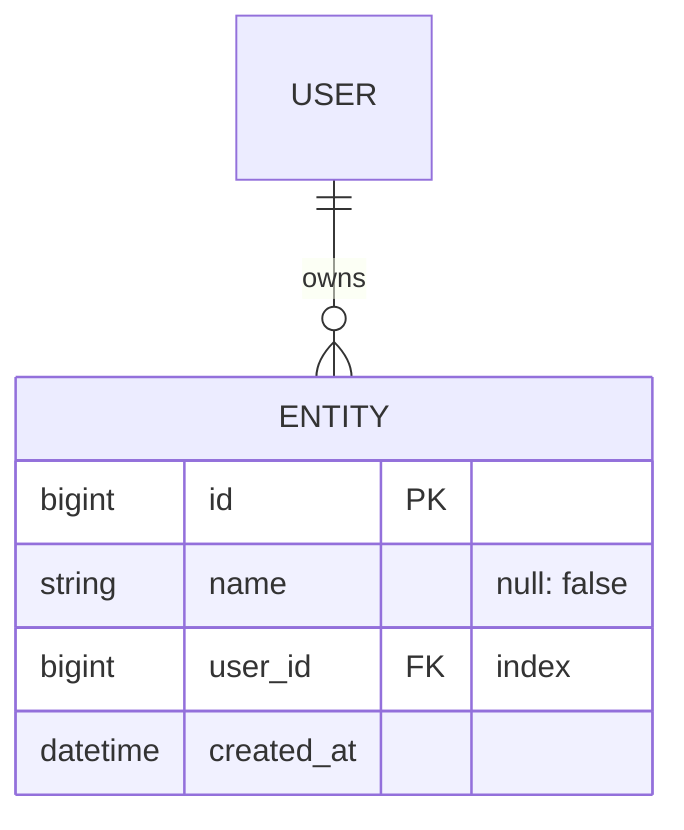

# {{PROJECT_NAME}} — Data schema

<!-- 🔴 A LIVING DOCUMENT. Every migration that changes the structure updates
     this file IN THE SAME COMMIT.

     `db/schema.rb` is the source of truth. This file is its human reading: if
     the two disagree, this one is wrong — never the other way round. Written
     in Mermaid rather than an image so GitHub renders it, it diffs, and a
     reviewer sees what changed. -->

**Last updated:** <!-- YYYY-MM-DD --> · **Matches migration:** <!-- version -->

---

## Entity relationships

## Tables

### `entities`

| Column | Type | Constraints | Why |
|---|---|---|---|
| `id` | bigint | PK | |
| | | | |

**Associations:** <!-- belongs_to / has_many, and `dependent:` on each one -->
**Indexes:** <!-- every foreign key, every searched column, every uniqueness -->
**Deletion:** <!-- what happens to children when the parent goes -->

---

## Decisions taken on this schema

| # | Question | Answer | Why |
|---|---|---|---|
| | <!-- 1-N or N-N between X and Y? --> | | |

## Change log

| Date | Migration | Change | Impact |
|---|---|---|---|
| | | | |
