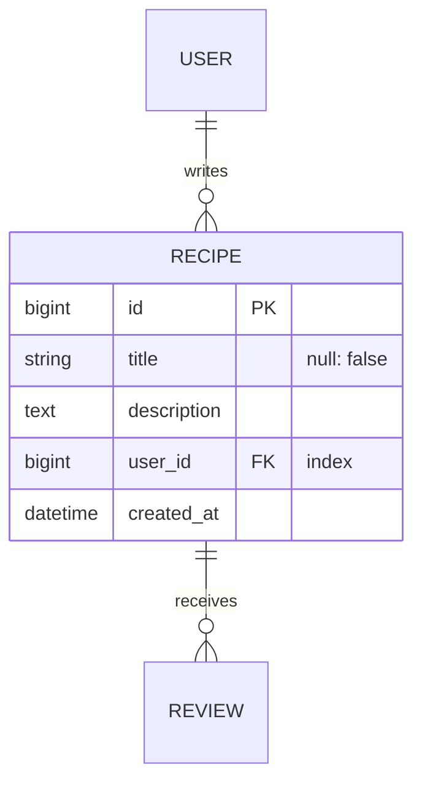

# Méthode projet — de l'initialisation à la livraison

Trois skills, trois moments. Ne pas les confondre :

| Skill | Répond à |
|---|---|
| `project-kickoff` | « Comment je crée le dépôt et le board ? » |
| **`methode-projet`** (celle-ci) | **« Où on en est, quel livrable maintenant, qui le valide ? »** |
| `methode-wagon` | « Comment j'écris cette ligne de code ? » |

**Ce que cette skill garantit :** aucun livrable n'est oublié, aucun n'est produit
au mauvais moment, et **aucun ne se périme en silence**.

---

> ℹ️ **Les chemins `~/Documents/Claude/ObsiClaud/...` cités ci-dessous sont des notes
> personnelles, non publiées.** Cette skill est autonome sans elles : elles ne font
> qu'ajouter le détail et les sources. Si vous l'installez depuis ce dépôt, ignorez-les
> ou remplacez-les par vos propres notes.

## 🔴 La règle qui prime sur toutes les autres

**Deux documents sont VIVANTS et doivent être à jour à chaque instant :**

1. **Le schéma de base de données** — `docs/SCHEMA.md`
2. **Le diagramme d'architecture** — `docs/ARCHITECTURE.md`

Ils ne sont pas des livrables de conception qu'on produit une fois puis qu'on
oublie. **Toute migration qui change la structure, et tout ajout de service, de
job ou de dépendance externe, les met à jour DANS LE MÊME COMMIT que le
changement.** Pas dans une passe de fin, pas « quand on aura le temps ».

Un schéma faux est pire que pas de schéma : on prend des décisions dessus.

**Comment savoir qu'ils sont à jour :**

- `db/schema.rb` fait foi pour les données. `docs/SCHEMA.md` en est la lecture
  humaine — s'ils divergent, c'est le Markdown qui a tort, jamais l'inverse.
- Les deux s'écrivent en **Mermaid**, pas en image : GitHub les rend nativement,
  ils se diffent, et une revue voit ce qui a changé. Une capture d'écran de
  schéma est morte le jour où elle est déposée.

~~~

~~~

**Le réflexe à avoir, sans qu'il le demande :** après avoir écrit une migration,
ouvrir `docs/SCHEMA.md` et le mettre à jour. Après avoir ajouté un service
externe, une file de jobs ou une dépendance, ouvrir `docs/ARCHITECTURE.md`.
Le dire dans le message de commit.

---

## Remplir les trois documents structurants

Le dépôt généré depuis le template `ai-gmented-pm/kickoff` porte trois fichiers
déjà charpentés. **Ils se remplissent, ils ne se réécrivent pas** — et surtout
ils ne se laissent pas vides.

### `docs/PRD.md` — l'intention produit

Écrit pour quelqu'un qui connaît déjà l'exercice : aucune section ne s'explique.
Ce qu'il faut savoir en le remplissant avec Romain :

- **§1 Problème** — de l'évidence, pas de la conviction. Si la seule preuve est
  « ça paraît évident », l'écrire ainsi : une hypothèse nommée coûte peu, une
  hypothèse cachée coûte cher. La ligne « coût de ne rien faire » se remplit
  toujours, c'est elle qui justifie la priorité.
- **§3 Résultats** — 🔴 **aucune cible sans baseline.** Une cible sans point de
  départ ne s'évalue pas, elle se discute. Et la contre-métrique se remplit :
  ce qui ne doit pas se dégrader pendant qu'on poursuit le reste.
- **§4 Non-objectifs** — la section qui fait gagner le plus de temps ensuite.
  Y écrire ce qu'on va **raisonnablement** te demander et à quoi la réponse est
  non.
- **§7 Exigences fonctionnelles** — numérotées `FR-n`, testables, chacune reliée
  à un résultat du §3. **Le libellé migre tel quel dans les critères
  d'acceptation de la story** : ne pas le reformuler en chemin, sinon plus
  personne ne fait le rapprochement.
- **§8 Données personnelles** — se remplit **avant** la première ligne de code
  qui en stocke, jamais avant le lancement. Rétro-ajouter une suppression, c'est
  une migration et une réécriture.
- **§11 Décisions ouvertes** — 🔴 **chaque ligne a un porteur ET une date.** Un
  journal de décisions sans dates est une liste de regrets.

**Ce que Claude fait :** remplir ce qui se déduit du contexte, poser en une fois
les questions du §11, et **laisser visibles les trous** plutôt que d'inventer
une baseline ou un chiffre. Un PRD avec trois cases vides est utilisable ; un
PRD avec trois chiffres inventés est dangereux.

**Ce que Romain fait :** approuver. Tant que le statut n'est pas `approved`
avec un nom et une date, le document est une proposition, et tout ce qui en
découle est une hypothèse.

### Du PRD aux wireframes — le passage à ne pas improviser

Les wireframes ne s'inventent pas : ils se **dérivent** du PRD, et la dérivation
est vérifiable.

**La source, dans le PRD :**

| Ce qu'on lit | Ce que ça produit |
|---|---|
| §6 Parcours principal | **Un artboard par étape** du parcours, dans l'ordre |
| §7 Exigences `FR-n` | Ce que chaque écran doit permettre — le libellé est repris tel quel |
| §2 Segment primaire | Le vocabulaire affiché, le niveau de détail |
| §8 Accessibilité | Contrastes et navigation clavier, dès le wireframe |

**Trois règles :**

1. 🔴 **Chaque artboard porte les `FR-n` qu'il satisfait**, écrits dessus. Un
   écran qui n'en satisfait aucun est une idée qu'on s'est faite en dessinant :
   soit elle remonte dans le PRD, soit elle disparaît.
2. 🔴 **Les quatre états, là où ils existent** : vide, chargement, erreur,
   plein. C'est là qu'on oublie 80 % des cas — et l'état d'erreur est celui
   qu'on ne dessine jamais.
3. **Mobile d'abord.** Bootstrap est mobile-first : dessiner desktop d'abord
   fait refaire le travail.

**L'outil, selon ce qu'on produit :**

| Besoin | Outil |
|---|---|
| **Wireframes et enchaînement d'écrans** | La skill **`design`** — un canvas multi-artboards publié en Artifact, que Romain édite visuellement (clic, panneau de propriétés, texte en ligne) et exporte en PNG/PDF |
| **Bibliothèque de composants** (design system) | L'outil **`DesignSync`** — il lit et écrit un projet claude.ai/design de type *design system*, composant par composant. ⚠️ Ce n'est **pas** l'outil des wireframes |
| **Maquettes haute fidélité, prototype cliquable** | Figma. ⚠️ Le connecteur Figma demande une autorisation : sans elle, produire dans le canvas et exporter |

**La mise à jour :** un `FR-n` qui change **invalide l'artboard qui le portait**.
Le dire au moment où l'exigence bouge, pas au moment de coder l'écran — c'est
précisément le décalage qui fait coder une interface périmée.

### `docs/SCENARIOS.md` — les comportements, en anglais lisible

**Un document vivant de plus**, et le seul qu'on puisse mettre entre les mains de
quelqu'un qui ne lit pas Ruby : chaque comportement attendu y est écrit en
**Given / When / Then**, en anglais intelligible, et pointe l'exemple RSpec qui
le vérifie.

🔴 **Le mapping se fait par la description du `it`, jamais par un numéro de
ligne.** Une référence `fichier:42` est fausse dès qu'on insère une ligne
au-dessus, et personne ne s'en aperçoit. La description, elle, survit aux
éditions et se retrouve :

```bash
bundle exec rspec spec/system/recipes_spec.rb -e "shows every published recipe"
```

**La règle qui garde le document honnête :** la clause `Then` et la description
du `it` disent **la même chose, dans les mêmes mots**. Si l'une est reformulée,
l'autre l'est dans le même commit — sinon le document devient décoratif.

**La chaîne de traçabilité, de bout en bout :**

```text
FR-n (PRD)  →  user story  →  S-n (SCENARIOS.md)  →  exemple RSpec
```

Un `FR-n` sans scénario n'est pas vérifié. Un scénario sans spec est une
promesse. Les deux se voient dans le tableau de couverture en fin de document —
**un trou nommé est une décision, un trou tu est une surprise en démo.**

⚠️ Les cas limites ont leur propre scénario : l'état vide, le refus et l'erreur
sont là où les produits cassent réellement. Le chemin heureux seul n'est pas une
couverture.

### `docs/ARCHITECTURE.md` — la forme technique

Structure C4 : contexte (§1), conteneurs (§2), puis les décisions (§3), les flux
critiques (§4), et l'exploitation (§6 à §8). Les diagrammes sont en **Mermaid**.

Ce qui se remplit toujours, parce que c'est ce qui casse :

- Le tableau des **dépendances externes du chemin critique** : chacune est une
  chose qui peut être en panne pendant une démo. Une dépendance sans repli est
  une décision — elle remonte en §3.
- **Ce qui se passe quand une étape échoue** dans chaque flux. « Ça réessaie »
  n'est une réponse qu'avec une limite et une destination pour les échecs.
- **La sauvegarde et le rollback** : tant que personne ne les a exécutés une
  fois, ce sont des hypothèses. Noter la date du dernier test réel.
- **§9 Dette assumée** : ce qu'on sait faux, pourquoi on l'accepte, ce qui
  déclenchera la réparation. Une dette écrite est une décision ; une dette non
  écrite est une surprise.

### `docs/SCHEMA.md` — la structure des données

`db/schema.rb` fait foi. Ce fichier en est la lecture humaine : **s'ils
divergent, c'est le Markdown qui a tort.** Pour chaque table : les contraintes
(`null: false`, unicité), les index (toute clé étrangère, tout champ cherché),
et ce que devient l'enfant quand le parent disparaît.

### 🔴 Et surtout : les tenir à jour

Voir la règle en tête de cette skill. Le réflexe, sans qu'il le demande :

| Ce que tu viens de faire | Ce que tu ouvres ensuite, même commit |
|---|---|
| Une migration qui change la structure | `docs/SCHEMA.md` + son journal |
| Livrer une US (comportement observable) | `docs/SCENARIOS.md` + la ref du `it` |
| Ajouter un service, un job, une dépendance externe | `docs/ARCHITECTURE.md` §1 et §10 |
| Prendre une décision structurante | `docs/ARCHITECTURE.md` §3 + un ADR |
| Changer le périmètre ou une cible | `docs/PRD.md` §5 ou §3 + §13 |
| Accepter un raccourci pour tenir une date | `docs/ARCHITECTURE.md` §9 |

Et le dire dans le message de commit : c'est ce qui rend la mise à jour
vérifiable en revue.

---

## 🔴 `docs/PROMPTS.md` — la bibliothèque de prompts

Le dépôt porte **un prompt écrit par livrable de conception** : PRD, wireframes,
charte graphique, schéma de données, diagramme d'architecture, stories, tests,
revue de code, revue de sécurité. Il vient du template `kickoff`, et Amorce le
génère pour les équipes.

**La règle : on ne rédige pas un prompt de conception de tête.** On ouvre
`docs/PROMPTS.md`, on prend celui du livrable, on remplace ce qui est entre
`<` et `>`. C'est ce qui fait que deux wireframes produits à trois semaines
d'écart se ressemblent encore.

**Ce que Claude fait, sans qu'il le demande :**

1. Avant de produire un livrable de conception, **lire l'entrée correspondante**
   de `docs/PROMPTS.md` et suivre ses contraintes — elles priment sur
   l'improvisation du moment.
2. En rendant le livrable, **dérouler la liste « Check before accepting »** de
   l'entrée et dire, point par point, ce qui est tenu et ce qui ne l'est pas.
   Un livrable qui arrive sans cette liste est un livrable qu'on accepte par
   lassitude.
3. Quand un prompt a produit une mauvaise sortie, **amender le fichier** dans le
   commit qui corrige le livrable. Un prompt est un actif du projet, pas un
   message jetable.

⚠️ **Ce qui manque à la bibliothèque s'y ajoute au moment où le besoin se
présente**, avec ses critères d'acceptation. Un prompt sans critères
d'acceptation est un vœu : c'est la liste de vérification qui le rend
réutilisable, pas sa formulation.

🔴 **Trois relais, comme toujours** : la bibliothèque vit dans le template
`ai-gmented-pm/kickoff` (`docs/PROMPTS.md`), dans le générateur d'Amorce
(`BibliothequePromptsGenerator`, qui la personnalise par profil) et ici. Une
règle de prompt qui change se change dans le générateur d'abord — le template
en est le rendu.

---

## 🔴 Les routes sont un livrable de conception, pas de la plomberie

Elles s'écrivent **avant le code**, après le schéma de données et avant les
specs — étape 5 bis du parcours. Sur une US : ouvrir `config/routes.rb`, écrire
les lignes, lancer `bin/rails routes`, lire ce qui sort.

**Ce que tu vérifies en le rendant :** les ressources sont nommées au pluriel
dans le vocabulaire du métier ; `resources ... only: [...]` ne déclare que ce
que l'US utilise ; l'imbrication ne dépasse jamais une profondeur ; aucune route
orpheline dans un sens ni dans l'autre ; et tu sais nommer le `_path` de chaque
écran du wireframe.

**Pourquoi c'est un livrable et pas une ligne de code.** Une route est une
décision de **découpage du domaine**. Écrite en premier, elle fait apparaître
qu'un besoin qui n'entre pas dans les sept actions RESTful est une deuxième
ressource — la conversation a lieu à ce moment-là, ou elle n'a jamais lieu.
Écrite au moment de coder, elle épouse le contrôleur qu'on avait déjà en tête et
ne révèle plus rien.

Sans elles, l'étape 6 est bloquée : une spec de requête a besoin du chemin, une
spec de feature a besoin du `_path`.

---

## 🔴 Deux passes avant qu'une US parte — et c'est toi qui les demandes

Une US n'est pas rendue sur la parole de celui qui l'a écrite. Deux passes,
**demandées explicitement**, jamais supposées faites.

| Passe | Répond à | Quand |
|---|---|---|
| **Vérification** | Est-ce que ça fait vraiment ce que l'US promettait, dans l'app qui tourne ? | Chaque US, avant d'ouvrir la PR |
| **Revue de sécurité** | Est-ce que ça ouvre quelque chose qui était fermé ? | Toute US qui touche l'auth, une saisie, un upload, de l'argent ou un appel tiers — **et une fois par semaine quoi qu'il arrive** |

**La vérification n'est pas « les tests sont verts ».** L'app tourne, et chaque
critère d'acceptation de l'issue y est parcouru un par un : les états vide,
erreur et chargement atteints exprès, le vrai appareil, la console propre, le
log sans la même requête imprimée trente fois. Une suite verte prouve que le
code fait ce que dit le test — pas que le test dit ce que dit l'US.

**La revue de sécurité** : `/security-review` sur le diff, plus les outils de
la stack (`brakeman`, `bundler-audit`), en **lisant ce qu'ils impriment**. Puis
les questions qui valent partout : toute clé nouvelle lue dans `ENV` et aucune
dans le code, strong params sur chaque écriture, aucune saisie rendue en markup
brut, aucune requête construite par interpolation, autorisation vérifiée côté
serveur et pas seulement masquée dans la vue.

🔴 **C'est toi qui décides et qui demandes.** À la fin du travail sur une US,
nomme laquelle des deux passes est due et demande-la — n'attends pas qu'il y
pense. Le silence n'est pas une passe : une US rendue sans l'une ni l'autre est
une US que personne n'a vérifiée. Et si aucune n'a tourné depuis une semaine,
la revue de sécurité est due, même si rien ne l'a déclenchée.

⚠️ **`/verify` n'existe pas comme commande installée** sur ce poste — la passe
de vérification se conduit à la main, dans l'app qui tourne. `/security-review`,
elle, existe. La liste des critères est dans `docs/QUALITY.md` du dépôt.

---

## 🔴 Qui fait foi, quand `kickoff` et `amorce` disent deux choses

Les deux produisent les mêmes documents de méthode par deux routes. Chaque
sujet a **un seul domicile** ; le tableau complet est dans `KICKOFF.md`, section
« Who is authoritative », et la comparaison détaillée dans
`ObsiClaud/dev/Kickoff et Amorce - recouvrement et arbitrage.md`.

| Sujet | Fait foi |
|---|---|
| Documents de méthode, règles d'or, couches de stack | **`kickoff`** |
| Spécification → issues, épiques, jalons, board | **`kickoff`** |
| **Les trois skills** (dont celle-ci) | **`kickoff`** (`skills/`) — depuis le 24/08/2026 |
| Le défaut de boilerplate (`minimal`) et ses raisons | **`kickoff`** (`docs/BOILERPLATE.md`) |
| Le `template.rb` exécutable | **`amorce`** (brique `boilerplate`) |
| `docs/PROMPTS.md` | **`amorce`** (brique `bibliotheque_prompts`) |
| Le texte d'un document dérivé d'un profil | **`amorce`** |
| La configuration du dépôt par API (labels, protection, board, Pages) | **`amorce`** |

🔴 **Ne jamais appliquer les deux au même dépôt.** Ils écrivent les mêmes sujets
sous des noms de fichiers différents — `docs/MILESTONES.md` contre
`docs/JALONS.md`, et deux DoD qui ne disent pas la même chose sur l'estimation.

⚠️ **`~/.claude/skills/` est une installation, jamais un lieu d'édition.** Une
skill se modifie dans `kickoff/skills/`, puis se réinstalle par copie. L'oubli
coûte cher : 66 lignes d'écart le 20/08/2026, 38 le 24/08.

---

## Le cycle, phase par phase

### Phase 0 — Poser le cadre

| Livrable | Où il vit | Qui valide |
|---|---|---|
| **PRD** — problème, résultats mesurables, non-objectifs, exigences | `docs/PRD.md` *(template fourni)* ; la genèse et le récit dans le vault | 🔴 **Romain** |

**On ne code pas avant.** L'échéance dimensionne le lotissement, les entités
nomment tout le reste. Tant que le PRD n'est pas validé, tout ce qui suit est
une hypothèse.

**Fini quand :** quelqu'un d'autre peut lire le PRD et dire ce qui est hors sujet.

### Phase 1 — Concevoir

| Livrable | Où il vit | Qui valide |
|---|---|---|
| **User stories + critères d'acceptation** | Issues GitHub, gabarit du dépôt | 🔴 **Romain** |
| **Wireframes** — états vide / chargement / erreur / plein, mobile d'abord | Figma ; le lien dans l'US | 🔴 **Romain** |
| **Prototype cliquable** *(si l'interaction n'est pas évidente)* | Figma | Romain |
| **Design system** — tokens, composants | Figma + `app/assets` | Romain |
| **Schéma de base de données** | `docs/SCHEMA.md` *(template fourni)* | 🔴 **Romain** |
| **Diagramme d'architecture** | `docs/ARCHITECTURE.md` *(template fourni)* | 🔴 **Romain** |

L'ordre compte : le schéma se conçoit **après** les US, parce qu'il en découle.
Le proposer avant, c'est modéliser un besoin qu'on n'a pas encore formulé.

⚠️ **Ne jamais présenter un schéma ou une architecture comme acquis.** Ce sont
des propositions dérivées : elles se rendent avec les questions ouvertes
explicitement listées (« 1-N ou N-N entre X et Y ? », « on héberge où ? »).

**Fini quand :** la migration peut s'écrire sans se reposer de question.

### Phase 2 — Exécuter

| Livrable | Où il vit | Qui valide |
|---|---|---|
| **Specs** — un test par critère d'acceptation, écrites AVANT le code, **et les specs existantes mises à jour** | `spec/` | CI |
| **Scénarios** — Given / When / Then en anglais lisible, mappés aux exemples RSpec | `docs/SCENARIOS.md` *(template fourni)* | 🔴 **Romain** |
| **Pseudo-code** — étapes numérotées en commentaires, dans la méthode | Dans le code livré | — |
| **Une branche par story**, nommée d'après elle (`<type>/<entite>-<action>`) | Le dépôt | — |
| **Code commenté** — commentaires en français, identifiants en anglais | Le dépôt | 🔴 **Romain (PR)** |
| **Mise à jour de `docs/SCHEMA.md`** si la structure a bougé | Même commit | 🔴 **Romain (PR)** |
| **Pull request** — quoi et pourquoi, CI verte, capture si l'UI bouge | GitHub | 🔴 **Romain** |
| **Revues proposées** — `/code-review` et `/security-review` | Avant le push | 🔴 **Romain décide, à chaque US** |

Le détail du geste de code — décomposer, coder en silo, MVC, niveau de code
attendu, ce qu'on ne refactorise pas — est dans la skill **`methode-wagon`**.
Ne pas le redire ici, l'appeler.

### Phase 3 — Livrer

| Livrable | Où il vit | Qui valide |
|---|---|---|
| **Déploiement vérifié EN PRODUCTION**, migrations comprises | L'app en ligne | 🔴 **Romain** |
| **README à jour** — URL, commandes, variables d'environnement | Le dépôt, **même commit** | Romain |
| **Mémoire du projet** — décisions et leurs raisons, pièges et leur parade | Vault, `CLAUDE.md` du projet | — |

---

## Le stack par défaut

🔴 **Le squelette d'application vient de `minimal`, le template Rails de
Le Wagon** — `minimal.rb` dans `lewagon/rails-templates`. C'est le défaut, il ne
se discute pas ; s'en écarter est légitime et **s'écrit dans le `README.md`**,
section « Décisions structurantes », dans le même commit.

```bash
rails new -d postgresql \
  -m https://raw.githubusercontent.com/lewagon/rails-templates/master/minimal.rb \
  --skip \
  .
```

`--skip` parce que le dépôt cloné porte déjà son README, son `.github/` et ses
documents de méthode : sans lui, `rails new` s'arrête sur un prompt de conflit
par fichier. Le détail des partis pris est dans `docs/BOILERPLATE.md` du dépôt.

Sauf décision contraire pour CE projet :

| Couche | Choix |
|---|---|
| Framework | **Rails 8**, monolithe |
| Base | **PostgreSQL** |
| Front | **Hotwire** (Turbo + Stimulus), **Bootstrap 5.3** |
| Assets | **Sprockets** (pas Propshaft — les feuilles du bootcamp sont en SCSS) |
| JavaScript | **importmap**. 🔴 Jamais `yarn add`, jamais jsbundling |
| Formulaires | **simple_form** |
| Tests | **RSpec** + FactoryBot + Capybara |
| Secrets | 🔴 **Toutes les clés dans `.env`**, jamais poussé — `dotenv-rails` en local, secrets de l'hébergeur en prod (règle d'or 28) |

### Les gems, par famille

**Socle** (installées d'office) : `sprockets-rails`, `sassc-rails`, `bootstrap`,
`autoprefixer-rails`, `font-awesome-sass`, `simple_form`, `dotenv-rails`.

**Stack du projet** : `ruby_llm` (LLM), `cloudinary` (images — le disque des
hébergeurs est éphémère), `neighbor` (vecteurs, RAG).

**Commentées, prêtes à décommenter** : `devise`, `pundit`, `pg_search`,
`searchkick`, `mission_control-jobs`, `pry-rails` + `pry-byebug`, `httplog`,
`hotwire-livereload`, `faker`.

🔴 **Une gem jamais vue en cours n'entre pas sans qu'il l'ait demandée.** Le
critère n'est pas la qualité de la gem, c'est sa capacité à la défendre.

Le détail — ce que chacune apporte, les étapes, le piège — est produit par
Amorce dans `docs/ACTIVER.md` du dépôt généré.

---

## Écrire idiomatique

Le code doit ressembler à celui qu'on lui enseigne. Les conventions complètes,
sourcées deck par deck :
`~/Documents/Claude/ObsiClaud/le-wagon/methode/Wagon - Idiomes Rails.md`

Les plus coûteuses à violer : `importmap` jamais `yarn` · Stimulus et attributs
`data-` jamais de `<script>` inline · **le style dans un `.scss`, jamais un
`style="..."` ni un `<style>` dans une vue** · **les helpers Rails et les path
helpers**, jamais une balise ni une URL écrite à la main · **les helpers des gems
déjà installées** (`f.input`, `current_user`, `icon`, `cl_image_tag`) ·
`simple_form_for` ·
strong params ·
`resources ... only:` · un seul niveau de nesting · `dependent: :destroy`
explicite · Active Storage jamais de colonne `photo_url` · partial en `locals` ·
SCSS un seul niveau · `redirect_to` après un POST réussi.

---

## Les deux portes

- **Definition of Ready** — a-t-on le droit de commencer ?
- **Definition of Done** — a-t-on le droit de dire que c'est fini ?

`~/Documents/Claude/ObsiClaud/le-wagon/methode/Wagon - DoR et DoD.md`
Le parcours complet entre les deux, étape par étape avec ses critères de
« fini quand » : `.../Wagon - Cheat sheet US.md`

---

## Les revues, et qui les déclenche

**Je propose, Romain décide.** Avant qu'une US parte, je demande s'il faut
passer `/code-review` et `/security-review` — et j'attends la réponse. Une revue
qui se lance toute seule finit par être ignorée ; une revue refusée est une
décision, et elle se note dans la PR.

🔴 **Cadence plancher : une revue de code ET une revue de sécurité par semaine**,
même si aucune US ne les a déclenchées. C'est un minimum, pas un plafond. Une US
qui touche l'authentification, un paiement, un upload ou des données
personnelles se fait relire quel que soit le jour de la semaine — et je le dis
plutôt que d'attendre le rendez-vous hebdomadaire.

## Ce que Claude ne tranche jamais seul

1. **Le périmètre** — ce qu'on ne fera pas est une décision de Romain.
2. **Le modèle de données** — proposer, lister les questions ouvertes, attendre.
3. **L'architecture** — même règle, et l'hébergeur avec.
4. **Ajouter une dépendance** — voir la règle des gems.
5. **Renoncer à un livrable** — une étape sans objet se dit et se justifie ;
   elle ne se saute pas en silence.

Quand un de ces cinq points se présente : poser la question, proposer une
recommandation argumentée, et **continuer sur tout ce qui n'en dépend pas**.

---

## Le réflexe de fin de session

Écrire dans le `CLAUDE.md` du projet, dans le vault : ce qui est livré, ce qui
reste ouvert, **et la prochaine action précise** — une phrase qui s'exécute sans
réfléchir. C'est ce qui rend une reprise à froid indolore, et c'est vital en
solo, où personne ne redit le contexte.
